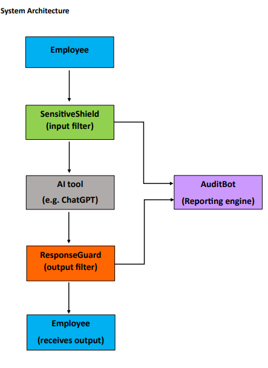

# ComplianceGuard — AI Security Gateway

> Built during Deloitte Digital Camp (China) 2026

---

## Overview

ComplianceGuard is an AI security gateway designed for corporate environments. It acts as an intermediary between employees and AI tools (such as ChatGPT), filtering sensitive data from both incoming prompts and outgoing responses — ensuring data privacy and regulatory compliance at all times.

---

## Problem Statement

Most companies allow employees to use AI tools for work. The risk is that employees may accidentally type sensitive information (such as ID numbers or financial data) into these tools, leading to data leaks or harmful AI-generated responses. ComplianceGuard addresses this by sitting between the employee and the AI tool, filtering both directions of communication.

---

## System Architecture

---

## Modules

**SensitiveShield — Input Filter**
Scans employee prompts for sensitive data such as names, ID numbers, and financial information before it reaches the AI tool. Sensitive data is replaced with placeholders, ensuring confidential information never leaves the organization.

**ResponseGuard — Output Filter**
Monitors AI-generated responses for misleading content, harmful instructions, or non-compliant information before it reaches the employee. Flagged responses are automatically blocked.

**AuditBot — Reporting Engine**
Logs all employee-AI interactions and generates a periodic Enterprise AI Security Risk Report. The report summarizes:
- Frequently detected sensitive information categories
- Number of blocked AI responses
- Overall risk patterns detected

---

## Business Value

- Reduces the risk of sensitive data leaks from AI tool usage
- Helps companies remain compliant with data protection regulations
- Prevents costly legal penalties
- Employees can use AI tools confidently with a security layer in place

---

## Key Strength

Specialization in Cloud Technology and Information Security Management provided the foundation to understand how data breaches occur, how sensitive data flows across systems, and how to identify enterprise data risks — directly informing the design of ComplianceGuard.

---

## Built By

**Samyuktha Rajeev**
BCA (Hons.) — Cloud Technology & Information Security Management
St. Teresa's College (Autonomous), Ernakulam
